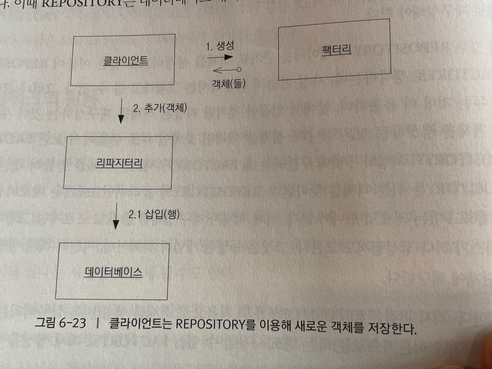
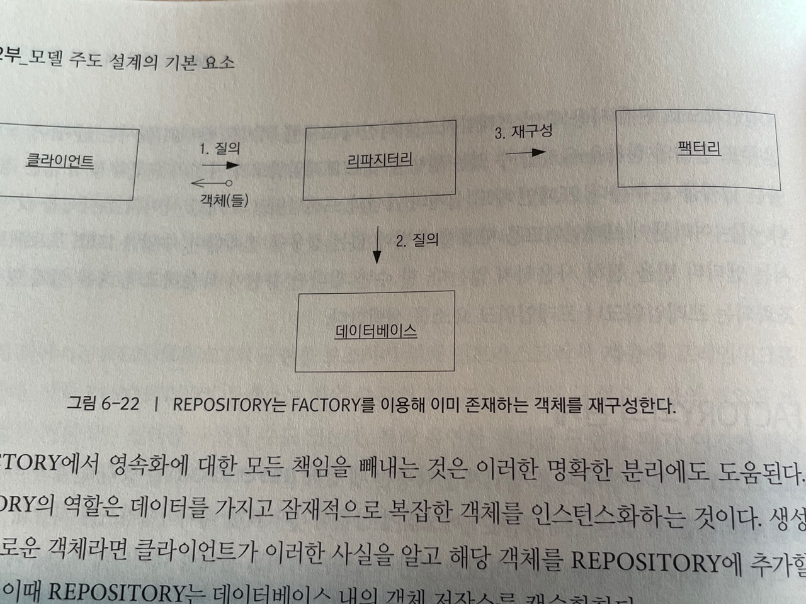

# 도메인 객체의 생명주기
> 모든 객체에는 생명주기가 있다. 어떤 객체는 단순하고 일시적으로 사용된 후 가비지 컬렉터에 보내지며 이런 객체는 복잡하게 만들 필요가 없다. 그러나 또 다른 어떤 객체들은 복잡한 상호의존성을 맺으며 여러 가지의 상태 변화를 겪기도 하는데, 이때 갖가지 불변식이 적용된다. 

## AGGREGATE

---

> 애그리거트는 모든 DDD 의 전술적인 지침중에서도 무엇보다 정확히 규명되지 않은 패턴 중 하나이며, 우리가 데이터 변경의 단위로 다루는 연관 객체의 묶음을 말한다.

> 각 애그리거트에는 루트(root) 와 경계(boundary) 가 존재한다. 경계는 애그리거트에 무엇이 포함되고 포함되지 않는지를 정의하며, 루트는 애그리거트에 속한 특정 엔티티를 가르키고 단 하나만 존재한다.
> 
> <b>경계 안의 객체는 서로 참조할 수 있지만, 경계 밖의 객체는 해당 애그리거트의 구성요소 가운데 루트만 참조할 수 있다.</b>

### AGGREGATE 잘 설계하기 위한 규칙

+ 루트 엔티티는 전역 식별성을 지니며, 애그리거트 경게 안의 엔티티는 지역 식별성을 지닌다. 지역 식별성은 해당 애그리거트 안에서만 유효하다.
+ 루트 엔티티는 불변식을 검사할 책이이 있다.
+ 루트 엔티티가 내부 엔티티(지역 식별성을 지닌) 에 대한 참조를 애그리거트 경계 밖의 객체에 전달해 줄 수는 있지만 그러한 객체는 참조를 일시적으로만 사용할 수 있다.
+ 루트는 VO 의 복사본을 다른 객체에 전달해 줄 수 있으며, 복사본에서는 어떤 일이 일어나든 문제되지 않는다. 
  + 복사본은 단순한 VALUE 이며, 애그리거트와는 더는 연관관계를 맺지 않을 것이기 때문이다.
+ 데이터베이스의 질의는 루트 엔티티만 획득 가능하며 탐색을 통해 지역 특별성을 지닌 객체를 가질 수 있다.
+ 애그리거트 안의 객체는 다른 애거리거트의 루트만 직접적으로 획득할 수 있다.
+ 삭제 연산은 애그리거트 경계 안의 모든 요소를 한 번에 제거해야 한다.
+ 애그리거트 경계 안의 어떤 객체를 변경하더라도 전체 애그리거트의 불변식은 모두 지켜져야 한다.


#### DDD 구현 추가 내용


```java
public class Product {
    ...
    
    public void planBacklogItem(String aSummary, String aCategory
            , BacklogItemType aType, StoryPoints aStoryPoints) {
        ...
    }
    ...
}
```
여기선 모든 메소드가 CQS 커맨드다. 즉 이는 새로운 컴포넌트를 컬렉션에 추가해 Product 의 상태를 수정하는데 이에 따라 void 반환 타입을 갖게 된다.
그러나 여러 애그리거트로 나눈 설계에선 다음과 같은 형태를 갖게 된다.

<small> > Command 는 결과를 반환하지는 않지만 시스템의 상태를 변경시킨다. Command 함수는 부주의하게 실행하는 경우 사이드 이펙트가 발생할 수 있기 때문에 함수간 사용 순서를 고민해야 한다.</small>

```java
public class Product {
    ...
    
    public BacklogItem planBacklogItem(String aSummary, String aCategory
            , BacklogItemType aType, StoryPoints aStoryPoints) {
        ...
    }
    ...
}
```
이와 같이 새롭게 설계된 메소드는 CQS 쿼리 계약을 맺고 있으며 팩토리로서 동작한다. <Strong> 즉 각 메소드는 새로운 애그리거트 인스턴스를 생성해서 그 참조를 반환한다.</Strong>

<small> > Query 는 결과값을 반환할 뿐 관찰 가능한 시스템의 상태를 변화시키지 않는다. 따라서 사이드 이펙트가 없다. </small>


<br>


####  CQS(Command Query Separation)
> CQS는 함수가 가급적 Command 와 Query 중 한 가지 역할만을 해야한다는 원칙이다. 질의를 수행하는 함수가 시스템의 상태를 변경시키는 등 부수 효과를 유발하면 예측 불가능한 버그가 발생하기 쉽다. CQS 준수를 통해 부수 효과가 존재하는 명령형 언어에서 부수 효과가 없는 함수형 언어의 장점을 제한적으로 누릴 수 있게 된다.


<br>

### 규칙: 진짜 고정자를 일관성 경계 안에 모델링하라

---

바운디드 컨텍스트에서 애그리거트를 찾으려면 모델의 진짜 고정자를 이해해야 한다. 이를 알아야만 주어진 애그리거트로 묶어야 할 객체가 무엇인지 결정 할 수 있다.
고정자는 언제나 일관성을 유지해야 한다는 비즈니스 규칙이다. 

#### 일관성
+ <Strong> 트랜잭션적 일관성: 즉각적이고 원자적이라 간주된다.</Strong>
+ 결과적 일관성: N개 이상의 같은 값을 반환해야 사용자에게 보여준다.


한 트랜잭션 당 애그리거트 인스턴스를 수정하도록 제한한다. 이는 애그리거트를 사용하는 가장 중요한 이유이다.


<br>

### 규칙: 작은 애그리거트로 설계하라

---

+ 엔터티보단 값 객체를 활용한다.


<br>

## FACTORY

---

> + 어떤 객체나 전체 애그리거트를 생성하는 일이 복잡해지거나 내부 구조를 너무 많이 드러내는 경우 팩토리가 캡슐화를 제공해준다.
> + 복잡한 복합 객체를 조립하는 일(팩토리의 책임)은 조립이 완료됐을 떄 해당 객체가 하는 일과(도메인 책임)과 가장 관련성이 적은 일이다.
> 클라이언트가 응용 계층 일부를 구성하고 있다면 도메인 계층에서 책임이 새어 나온다는 것이다.
> + 일반적으로 팩토리는 모델의 어떤 부분도 표현하지는 않지만 해당 모델을 나타내는 객체를 뚜렷하게 드러내는데 일조한다.
> + 팩토리는 객체의 생성과 재구성이라는 생명주기 전이를 캡슐화한다.

<br>

#### 팩토리를 잘 설계하기 위한 규칙

---

1. 도메인의 생성 방법은 원자적이어야 하며, 생성된 객체나 애그리거트의 불변식을 모두 지켜야 한다. 
2. 팩토리는 일관성 있는 상태에서만 객체를 만들어 낼 수 있어야 한다. 엔티티의 경우 이것은 전체 애그리거트를 생성하는 것을 의미하며, 이때 모든 불변식을 충족하고 선택적인 요소도 추가될 것이다. 
3. Value Object 의 경우에는 모든 속성이 올바른 최종 상태로 초기화된다는 것을 의미한다.
4. 인터페이스를 통해 올바르게 생성할 수 없는 객체를 요청할 수 있다면 예외를 던지거나 적절하지 않은 값을 반환하도록 보장한다. 
5. 팩토리는 생성된 클래스보다 생성하고자 하는 타입으로 추상화돼야 한다.

<br>

#### 팩토리와 팩토리 위치 선정

---

+ 애그리거트의 루트에 팩토리 메소드를 만들 수 있다. 
    + 한 요소가 추가될 때 애그리거트의 무결성을 보장하는 책임을 루트가 담당하고, 동시에 모든 외부 클라이언트에게서 애그리거트의 내부 구현을 감출 수 있다.
+ 밀접한 관련이 있는 특정 객체에 만들 수 있다.
    + 데이터나 규칙이 많은 객체를 생성할 때 해당 객체의 생성 정보를 필요로 하는 것을 주일 수 있다.

<br>

#### 생성자만으로 충분한 경우

---

> 다형성을 활용하지 않는 간단한 객체에 팩토리를 사용하면 코드를 이해하기 어렵게 만들 수 있다.

<br>

#### 인터페이스 설계

---

+ 각 연산은 원자적이어야 한다.
  + 복잡한 객체를 만들어내는데 필요한 것들을 모두 한 번에 전달해야 한다.
  + 생성이 실패해서 특정 불변식이 충족되지 못하는 상황에서는 예외나 널을 반환할 수 있다.  
+ 팩토리는 자신에게 전달된 인자와 결합될 것이다.
  + 입력 매개변수를 선택하는 데 신경써야 한다. (의존성의 덫이 발생할 수 있다.)
  + 인자가 단순히 생성물에 들어가는 것이라면 가장 의존성이 적당한 상태이다.
  + 인자를 끄집어내서 객체 생성 과정에 사용한다면 결합은 더 강해진다.

<br>

#### 불변식 로직의 위치

---

> 객체는 해당 객체가 활동하는 생명주기 동안 결코 적용되지 않을 로직을 수행할 필요는 없다. 그런 경우에는 팩토리가 불변식을 둘 논리적 위치가 되며, 생성물은 더욱 단순하게 유지된다.

<br>

#### ENTITY 팩토리와 VALUE OBJECT 팩토리

---

+ 팩토리를 통해 생성된 Value Object 는 불변적이다. 즉, 생성물이 완전히 최종적인 형태이다.
+ 팩토리를 통해 생성될 Entity 는 식별자(DB의 시퀀스와는 다른 유니크한 식별자)를 반드시 전달받아야 한다.

<br>

## REPOSITORY

---

> ENTITY 나 VALUE 를 탐색하기 위한 진입점이다.

+ 애그리거트의 루트에서만 접근해야 한다.
+ 단순하고 의도를 들어내는 인터페이스로 소통한다.
+ 특정한 기준으로 객체를 선택하고 속성값이 특정 기준을 만족하는 완전히 인스턴스화된 객체나 객체 컬렉션을 반환하는 메소드를 제공함으로써 실제 저장소와 질의 기술을 캡슐화한다.

<br>

#### 장점

---

+ REPOSITORY 는 영속화된 객체를 획득하고 해당 객체의 생명주기를 관리하기 위한 단순한 모델을 클라이언트에 제시한다.
+ REPOSITORY 는 영속화된 기술과 다수의 데이터베이스 전략, 또는 심지어 다수의 데이터 소스로부터 애플리케이션과 도메인 설계를 분리해준다.
+ REPOSITORY 는 객체 접근에 관한 설계 결정을 전해준다.
+ REPOSITORY 를 이용하면 테스트에서 사용할 가짜 구현을 손쉽게 대체할 수 있다.

<br>

#### REPOSITORY 에 질의하기

---

> 모든 REPOSITORY 는 클라이언트가 특정 기준에 부합하는 객체를 요청할 수 있는 메서드를 제공하며, 이러한 인터페이스를 설계하는 방법은 여러 가지가 있다.

+ 식별자를 기준으로 한 ENTITY 조회
+ 특정 속성값이나 복잡한 매개변수 연산을 토대로 한 객체 컬렉션 요청
+ 값 범위에 따른 객체 선택
+ SPECIFICATION 기반 질의를 이용하면 클라이너트가 질의의 획득 방법에 대해서는 신경 쓰지 않고도 원하는 바를 서술할 수 있다. (즉, 원하는 바를 구체화할 수 있다.)
  + DB 쿼리의 조건을 Spec 으로 작성해 Repository 에 적용하는 방법 : JpaSpecificationExecutor<T> 인터페이스
  
<br>

#### 클라이언트 코드가 REPOSITORY 구현을 무시한다(개발자는 그렇지 않지만) 

---

> 영속화 기술을 캡슐화하면 클라이언트가 매우 단순해지고 리파지터리 구현에서 완전히 분리된다.
+ 개발자들은 캡슐화된 행위를 활용하는 것에 내포된 의미를 알아야 한다.
+ 리파지터리 이용하는 개발자와 질의를 구현하는 개발자는 서로 피드백을 주고받아야 한다.
  + 어떤 객체 또는 컬렉션에 대한 탐색인지 알고 사용해야 한다? 

<br>

#### REPOSITORY 구현

---

+ 타입을 추상화 한다.
  + 특정 타입의 모든 인스턴스를 담기는 하지만 이것이 각 클래스마다 하나의 Repo 가 필요한 것은 아니다.
  + 타입은 계층구조상의 추상 상위 클래스가 될 수 있다. (TradeOrder 는 BuyOrder 혹은 SellOrder 일 수 있다.)
  + 현재 이용 중인 데이터베이스 기술에는 다형성이 존재하지 않아서 발생할 수 있는 제약조건에 마주치게 될 수 있다.
+ 클라이언트와 분리를 활용한다.
  + 클라이언트에서 직접 메커니즘을 호출했을 때보다 더 자유롭게 Repo 구현을 변경할 수 있다.
  + 이로써 영속화 전략을 자유롭게 교체하면서 질의 기법을 다양하거나 메모리상 캐싱 성능을 최적화 할 수 있다.
+ 트랜잭션 제어를 클라이언트에 둔다.
  + 커밋하는 컨텍스트가 있을 것이다.

<br>

#### 프레임워크 활용

---

> 일반적으로 현재 사용 중인 프레임워크를 자신의 요구에 억지로 맞추려고 해서는 안된다.

<br>

#### FACTORY 와의 관계

---

> 팩토리가 객체 생애의 초기 단계를 다루는데 반해 Repo 는 중간과 마지막 단계를 관리하는데 도움된다.

> 팩토리가 새로운 객체를 만들어 내는 데 반해 Repo 는 기존 객체를 찾아낸다. Repo 의 클라이언트에게는 메모리상에 객체가 존재하고 있는 것으로 보여야 한다.

 

 
<br>

#### 관계형 데이터베이스를 위한 객체 설계

---

> 객체지향 도메인을 영속적인 형태로 표현하는 관계형 데이터베이스의 경우에는 단순하게 직접적으로 표현하는 편이 가장 좋다.
> 아마 애그리거트에 들어 있을 부가적인 사항들을 비롯해 하나의 테이블 행은 하나의 객체를 담고 있어야 한다.

<br>


